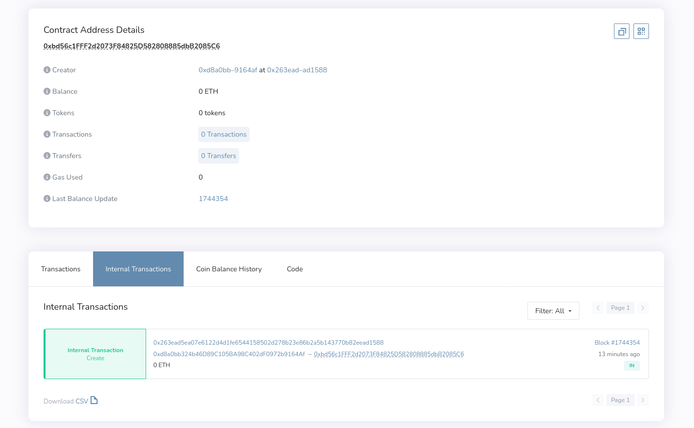

# Foundry

This guide provides step-by-step instructions on how to deploy smart contracts on BOB using Foundry.

## Objectives
1. **Set Up Foundry for BOB**: Learn how to set up Foundry, a development environment, and configure it for your BOB smart contract development.

2. **Create an Smart Contract for BOB**: Understand how to create your own Coin smart contract.

3. **Compile a Smart Contract for BOB**: Compile your Coin smart contract using the Foundry development environment.

4. **Deploy a Smart Contract to BOB**: Deploy your compiled Coin smart contract to the BOB platform.

5. **Interact with a Smart Contract Deployed on BOB**: Learn how to interact with the smart contract you've deployed on the BOB platform.

## Prerequisites

Before you can deploy smart contracts on BOB, ensure you have the following prerequisites:

- An account on BOB. You should have already set up an account on the network.
- [Foundry](https://book.getfoundry.sh/) installed and configured on your development environment. [Installation guide](https://book.getfoundry.sh/getting-started/installation) for foundry.  

## Creating Contract 

- Start a new project with Foundry.

```shell
$ forge init coin
```

- Create a new `Coin.sol` file in src directory.

```shell
$ cd coin
$ touch Coin.sol
```

- Enter the below code in `Coin.sol` file, To learn more about the contract [checkout guide](https://github.com/ethereum/solidity/blob/develop/docs/introduction-to-smart-contracts.rst).

```solidity

// SPDX-License-Identifier: GPL-3.0
pragma solidity ^0.8.4;

contract Coin {
    // The keyword "public" makes variables
    // accessible from other contracts
    address public minter;
    mapping(address => uint) public balances;

    // Events allow clients to react to specific
    // contract changes you declare
    event Sent(address from, address to, uint amount);

    // Constructor code is only run when the contract
    // is created
    constructor() {
        minter = msg.sender;
    }

    // Sends an amount of newly created coins to an address
    // Can only be called by the contract creator
    function mint(address receiver, uint amount) public {
        require(msg.sender == minter);
        balances[receiver] += amount;
    }

    // Errors allow you to provide information about
    // why an operation failed. They are returned
    // to the caller of the function.
    error InsufficientBalance(uint requested, uint available);

    // Sends an amount of existing coins
    // from any caller to an address
    function send(address receiver, uint amount) public {
        if (amount > balances[msg.sender])
            revert InsufficientBalance({
                requested: amount,
                available: balances[msg.sender]
            });

        balances[msg.sender] -= amount;
        balances[receiver] += amount;
        emit Sent(msg.sender, receiver, amount);
    }
}
```

## Compiling Contract 

- To compile contract run the followling command. 

```shell
$ forge build
```

## Deploying Contract

- To deploy the contract via the terminal, you'll need your private key. If you're using MetaMask, be cautious when exporting your private key as it can be risky. Checkout [article](https://support.metamask.io/hc/en-us/articles/360015289632-How-to-export-an-account-s-private-key) to get your private key from metamask.

- Deploy compiled smart contract 

```shell
$ forge create --rpc-url <enter_bob_rpc_url> --private-key <enter_private_key> src/<enter_contract_name>.sol:<enter_contract_name>
```

- For coin smart contract 

```shell
$ forge create --rpc-url wss://l2-fluffy-bob-7mjgi9pmtg.t.conduit.xyz --private-key <enter_private_key> src/Coin.sol:Coin
```

- The rpc url can be changed checkout [conduit](https://app.conduit.xyz/published/view/fluffy-bob-7mjgi9pmtg) to get the latest endpoints. 

- The output in the terminal should look similar to this

```shell
Deployer: 0xd8a0bb324b46D89C105BA98C402dF0972b9164Af
Deployed to: 0xbd56c1FFF2d2073F84825D582808885dbB2085C6
Transaction hash: 0x263ead5ea07e6122d4d1fe6544158502d278b23e86b2a5b143770b82eead1588
```

## Interaction with Contract

- Checkout [testnet explorer](https://explorerl2-fluffy-bob-7mjgi9pmtg.t.conduit.xyz) to get contract details using Transaction hash. 



- Get [ABI](https://docs.soliditylang.org/en/latest/abi-spec.html) of Coin contract. 

```shell
$ forge build --silent && jq '.abi' ./out/Coin.sol/Coin.json > coin_contract_abi.json
```

## Notes

Please note the following:

- Links provided in this guide can change over time. Make sure to check for the most up-to-date resources and documentation.

- Testnet environments, like the one mentioned in this guide, may be restarted or reset periodically. Be prepared for changes and interruptions in testnet activities.

Feel free to revisit this guide and check for updates or changes in the links and testnet status as needed.

## References
- [Coin contract Code](https://github.com/ethereum/solidity/blob/develop/docs/introduction-to-smart-contracts.rst)
- [Foundry](https://book.getfoundry.sh/)
- [Testnet Conduit](https://app.conduit.xyz/published/view/fluffy-bob-7mjgi9pmtg)  