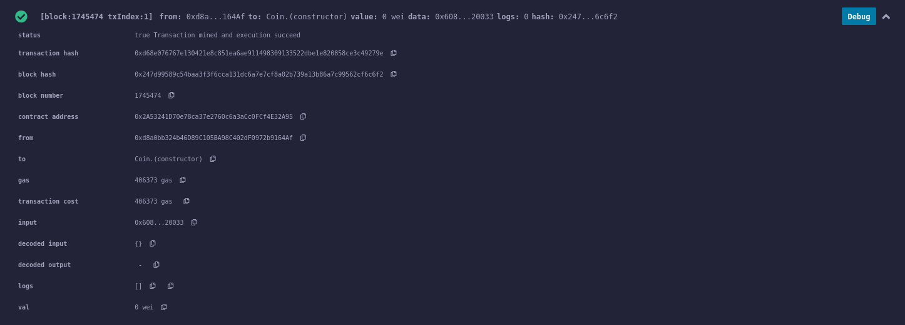

<!-- ---
sidebar_position: 2
--- -->

# Remix

This guide provides step-by-step instructions on how to deploy smart contracts on BOB using Remix.

# Objectives
1. **Set Up Remix for BOB**: Learn how to set up Remix, a development environment, and configure it for your BOB smart contract development.

2. **Create an Smart Contract for BOB**: Understand how to create your own Coin smart contract.

3. **Compile a Smart Contract for BOB**: Compile your Coin smart contract using the Remix IDE.

4. **Deploy a Smart Contract to BOB**: Deploy your compiled Coin smart contract to the BOB platform.

5. **Interact with a Smart Contract Deployed on BOB**: Learn how to interact with the smart contract you've deployed on the BOB platform.

# Prerequisites

Before you can deploy smart contracts on BOB, ensure you have the following prerequisites:

- An account on BOB. You should have already set up an account on the network.
- Login to [Remix](https://remix.ethereum.org/) IDE.

# Creating Contract 

- Create a new project with Remix. Under `contracts` folder create a new file `Coin.sol`.

- Enter the below code in `Coin.sol` file, To learn more about the contract [checkout guide](https://github.com/ethereum/solidity/blob/develop/docs/introduction-to-smart-contracts.rst).

```solidity

// SPDX-License-Identifier: GPL-3.0
pragma solidity ^0.8.4;

contract Coin {
    // The keyword "public" makes variables
    // accessible from other contracts
    address public minter;
    mapping(address => uint) public balances;

    // Events allow clients to react to specific
    // contract changes you declare
    event Sent(address from, address to, uint amount);

    // Constructor code is only run when the contract
    // is created
    constructor() {
        minter = msg.sender;
    }

    // Sends an amount of newly created coins to an address
    // Can only be called by the contract creator
    function mint(address receiver, uint amount) public {
        require(msg.sender == minter);
        balances[receiver] += amount;
    }

    // Errors allow you to provide information about
    // why an operation failed. They are returned
    // to the caller of the function.
    error InsufficientBalance(uint requested, uint available);

    // Sends an amount of existing coins
    // from any caller to an address
    function send(address receiver, uint amount) public {
        if (amount > balances[msg.sender])
            revert InsufficientBalance({
                requested: amount,
                available: balances[msg.sender]
            });

        balances[msg.sender] -= amount;
        balances[receiver] += amount;
        emit Sent(msg.sender, receiver, amount);
    }
}
```

# Compiling Contract 

- To compile contract go to `Solidity Compiler` section of IDE, select and compile `Coin` smart contract.

- `Coin` smart contract can also be directly compiled by right clicking on `Coin.sol` file and selct compile. 


# Deploying Contract

- To deploy the compiled coin smart contract first open the metamask extension and make sure the wallet is connected to the BOB network.

- Choose the Remix `ENVIRONMENT` aand `Injected Provider - MetaMask`. Remix will deploy contract to connected network ie BOB. 

- Select contract as `Coin` click `Deploy` and sign the transaction pop up message on metamask. 


- The contract details will be displayed in remix terminal. 




# Interaction with Contract

- Checkout [testnet explorer](https://explorerl2-fluffy-bob-7mjgi9pmtg.t.conduit.xyz) to get more contract details. 


<!-- - image.png -->

- Get [ABI](https://docs.soliditylang.org/en/latest/abi-spec.html) of Coin contract from remix IDE `Solidity Compiler` Section. 


## Notes

Please note the following:

- Links provided in this guide can change over time. Make sure to check for the most up-to-date resources and documentation.

- Testnet environments, like the one mentioned in this guide, may be restarted or reset periodically. Be prepared for changes and interruptions in testnet activities.

Feel free to revisit this guide and check for updates or changes in the links and testnet status as needed.

## References
- [Coin contract Code](https://github.com/ethereum/solidity/blob/develop/docs/introduction-to-smart-contracts.rst)
- [Remix](https://remix.ethereum.org/)
- [Testnet Conduit](https://app.conduit.xyz/published/view/fluffy-bob-7mjgi9pmtg)  