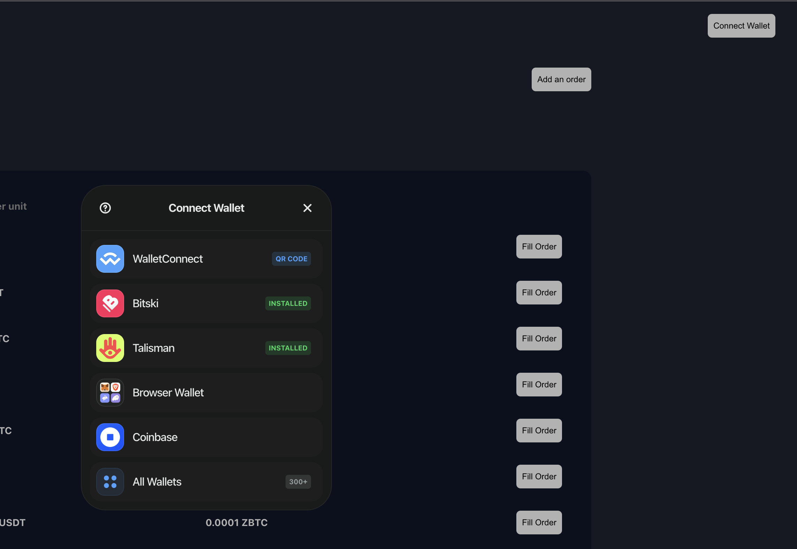
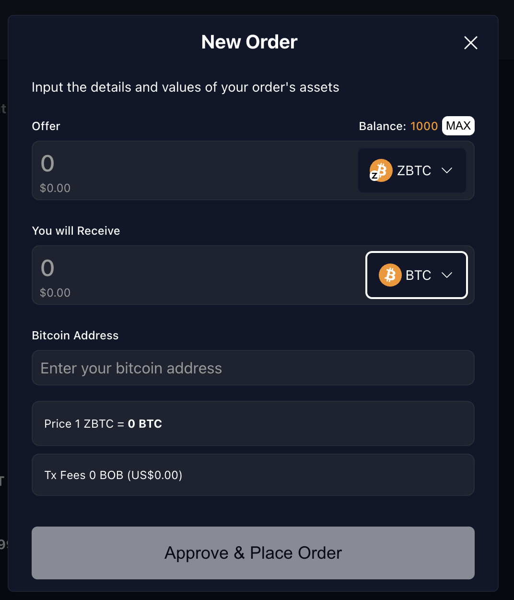

# BTC Swap

This example demonstrates how BOB is leveraged to build a peer-to-peer (P2P) swap application that allows two parties to swap ERC20 tokens and BTC without using a custodian.

:::note

The code for this example can be [found in the P2P swap demo GitHub repository](https://github.com/bob-collective/p2p-swap-demo)

:::

## Demo

We have created a testnet demo of the P2P swap, allowing anyone to swap BTC for ERC20 tokens, ERC20 tokens for BTC, and exchange one ERC20 token for another. The application currently supports testnet BTC, testnet USDT, and ZBTC (ZBTC is a placeholder for an arbitrary bridged BTC token).

### Connecting Your Wallet

:::note

When connecting to our test network the gas token will be shown as BOB. This can be changed to ETH in the network settings of your wallet.

:::

:::note

The UI can sometimes fail to connect if you have multiple wallets installed. If this happens you should disable all wallet extensions other than the one you want to use for the demo.

:::

:::note

We have seen an intermittent issue connecting to wallets on some Android devices.

:::

- Install one of the supported EVM wallets: MetaMask and Frame. Others will likely work as well but are not tested.
- Install one of the supported Bitcoin testnet wallets: Electrum. Others will likely work as well but are not tested.
- Go to [demo.gobob.xyz](https://demo.gobob.xyz)
- Connect to your EVM wallet using the 'Connect Wallet' button at the top right of the UI.



### Creating and Funding Test Accounts

You will need two accounts for this demo, so that you can both create and fulfil orders. For each account:

- Click the 'Get ETH' button to fund your account with ETH. This will be needed for transaction fees.
- After the ETH tokens have arrived in your wallet, click on the 'Get Tokens' button to fund your account with ERC20 tokens to used when adding an order.
- Import the ERC20 tokens from the following contract addresses:
  - ZBTC: `0x4f01078121e90915F9f1448DE4b3C2515B5e2F3B`
  - USDT: `0x3c252953224948E441aAfdE7b391685201ccd3bC`
- You will also need some test BTC from the [Bitcoin testnet faucet](https://bitcoinfaucet.uo1.net/).

:::note

The faucet is configured to mint 30,000 tokens for each currency. If you want to create orders for more than this amount, the faucet can be called multiple times.

:::

#### Known Issues

- If you have connected your wallet to an earlier version of the application, you may see an error (`No chain was provided to the request`). If this happen you should disconnect and then reconnect your wallet.
- ETH tokens need to be minted first, as ETH is required to pay the transaction fees for minting ERC20s.

### Creating an Order

:::note

Orders are shown with a price per unit even though BTC orders cannot be partially filled. That means that if you offer 1 BTC in exchange for 25,000 USDT, you will see a price per unit of 0.00004 in 'Sell' table

:::

- Click on the 'Add an order' button.
- Select the tokens you want to offer and receive
  - If creating an order to swap to BTC, you will need to add a valid Bitcoin testnet address.
- Click on 'Approve & place order'
  - The first time you create an order with each token, you will be prompted to approve a spending cap before you can submit the transaction. You will only need to do this once. There is no need to submit the form twice: as soon as the spending cap transaction has completed you'll be prompted to sign the order transaction.

You can see all the orders you have placed by clicking on the 'Sell' tab. Orders listed under the 'Buy' tab are available for you to fulfil.



### Fulfilling an Order

:::note

Partial fulfillment of orders is only available for swaps involving two ERC20 tokens. Swaps involving BTC can only be fulfilled in full.

:::

:::note

BTC testnet block target times are 20 minutes, so it may take several minutes before you can complete the transaction.

:::

The process for fulfilling an order is slightly different depending on whether you are swapping an ERC20 for another ERC20, or for BTC.

#### Fulfilling an ERC20 <-> ERC20 Order

- Switch to the account you created for fulfilling orders.
- In the 'Buy' table find the order you created in the previous step
- Click on the 'Fulfil order' button, and enter the amount you wish to fulfil.
- You will be prompted to sign the transaction in your wallet.

If you now switch back to the account you used to create the order, you will see that amount available has decreased. If the order has been fulfilled completely, it will no longer be shown under the 'Sell' tab.


#### Fulfilling an ERC20 -> BTC order (i.e., buying BTC)

- Switch to the account you created for fulfilling orders.
- In the 'Buy' table find the swap you created with your selling account offering BTC (as the seller) in exchange for an ERC20.
- Click on 'Fill Order.' The 'Pay with' and 'You will receive' fields are non-editable.
- Enter a valid testnet BTC address.
- Submit the form.

The 'Fulfil order' button will now be disabled, and you will see a countdown next to it. This is how long the other party in the swap has to send you the BTC. Once the timer reaches 0, you will be able to cancel the order. This does not happen automatically: the other party will still be able to send the BTC unless you cancel the order.

- Switch back to your selling account.
- You will now see an 'Accepted BTC Orders' table under the 'Sell' tab.
- Find the order you created in this table, and click on the 'Complete order' button.
- Using a BTC wallet connected to the BTC testnet, send the BTC amount to the address shown. You can scan the QR code to use a mobile wallet.
- You will be able to complete the order as soon as one confirmation has been received.
  - If you close the modal or navigate away from the app, clicking on the 'Complete Order' button again will show you the current status of the transaction.

#### Fulfilling a BTC -> ERC20 order (i.e., selling BTC)

- Switch to the account you created for fulfilling orders.
- In the 'Buy' table find the swap you created with your selling account offering an ERC20 token (as the seller) in exchange for BTC.
- Click on 'Fill Order.' The 'Pay with' and 'You will receive' fields are non-editable.
- Submit the form.

You will now see an 'Accepted BTC Orders' table under the buy tab.

- Find the order in the table, and click on the 'Complete Order' button.
- Using a BTC wallet connected to the BTC testnet, send the BTC amount to the address shown. You can scan the QR code to use a mobile wallet.
- You will be able to complete the order as soon as one confirmation has been received.
  - If you close the modal or navigate away from the app, clicking on the 'Complete Order' button again will show you the current status of the transaction.

If you switch back to your selling account before completing the order, you will see the order in the 'Accepted BTC Orders' table under the 'Sell' tab. If the order is not completed by the buyer within the allowed time, you will be able to cancel the order.


## Demo Code

TODO: Code is only partially documented/

### The Contract

The contract that this example uses can be found in `src/swap/Btc_Marketplace.sol`. Example usage can be seen in its tests in `test/swap/Btc_Marketplace.t.sol`. The contract is a work in progress, with some bitcoin-related parts being mocked. Its usage is as follows:

#### Buying BTC

- Alice calls `placeBtcBuyOrder` and specifies amounts and a bitcoin address.
- Bob calls `acceptBtcBuyOrder`
- Bob makes the bitcoin transfer
- Bob calls `proofBtcBuyOrder`, or Alice can call `cancelAcceptedBtcBuyOrder` after a timeout.

#### Selling BTC

- Alice calls `placeBtcSellOrder` specifying the amounts
- Bob calls `acceptBtcSellOrder` and specifies a bitcoin address
- Alice calls `proofBtcSellOrder`, or Bob can call `cancelAcceptedBtcSellOrder`

For both buying and selling orders, if the order has not yet been accepted, Alice can withdraw the request using `withdrawBtcSellOrder`/`withdrawBtcBuyOrder`.

### Set up a Local Environment

1. Clone [https://github.com/bob-collective/bob](https://github.com/bob-collective/bob)
2. Install [Docker](https://www.docker.com)
3. Run `docker-compose up`
4. Verify that Regtest and Electrum are running by checking for the latest blocks at [http://localhost:3002/blocks](http://localhost:3002/blocks)
5. Add BOB L2 testnet to your EVM wallet and fund it with ETH using [Conduit](https://app.conduit.xyz/published/view/fluffy-bob-7mjgi9pmtg)

An example application can be found at [https://github.com/bob-collective/bob-ui-poc](https://github.com/bob-collective/bob-ui-poc). This has been built using [Viem](https://viem.sh/), [Wagmi](https://wagmi.sh/), React and Typescript, but you can interact with the smart contract using your preferred tools and frameworks.

### Funding Your Wallet with ERC20 Tokens

This can be done using the faucet buttons as described in the [Creating and Funding Test Accounts](#creating-and-funding-test-accounts)above.

#### Getting the Smart Contract ABIs in the UI

This is done using a React hook which extends Viem's `getContract` method. This allows contract member types to be inferred, rather than respecified in the application.

```ts
import { getContract } from "viem";
import { usePublicClient, useWalletClient } from "wagmi";
import { contracts, ContractType } from "../constants";
import { useMemo } from "react";

// Wrapper around ethers Contract to automatically get contract types
// with read and write objects automatically constructed from provider and signer.
const useContract = (contractType: ContractType) => {
  const publicClient = usePublicClient();
  const { data: walletClient } = useWalletClient();

  return useMemo(() => {
    const { address, abi } = contracts[contractType];

    return getContract({
      address,
      abi,
      publicClient,
      walletClient: walletClient ?? undefined,
    });
  }, [walletClient, publicClient, contractType]);
};

export { useContract };
```

This can then be called in the application:

```ts
// contracts/config.ts
const contracts = {
  [ContractType.BTC_MARKETPLACE]: {
    address: "0xd6cd079ee8bc26b5000a5e1ea8d434c840e3434b",
    abi: BtcMarketplaceAbi,
  },
} as const;

// App.tsx
const { read: readBtcMarketplace, write: writeBtcMarketplace } = useContract(
  ContractType.BTC_MARKETPLACE
);
```
