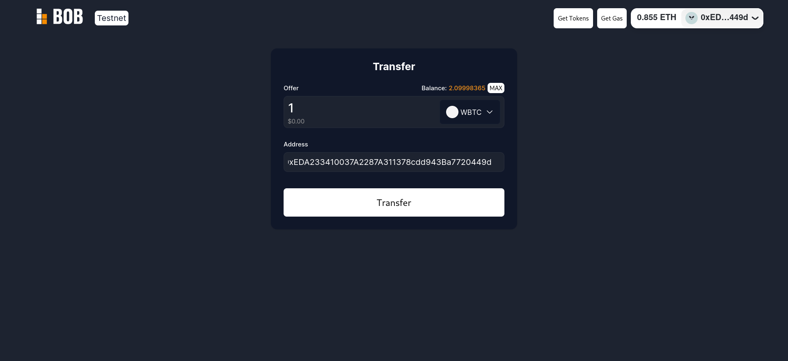

# Gas fee payment in WBTC using ERC-2771

In this example, we will show how WBTC can be used for gas fee payments using the [ERC-2771 standard](https://eips.ethereum.org/EIPS/eip-2771) on the BOB testnet. This enables users to transact without the necessity to own ether.

:::info Example Code

The source code for this demo can be found in [this repository](https://github.com/bob-collective/demo-meta-transactions-transfer/).

:::



## Local development

### Contract addresses and links

WBTC contract address: `0x833d9398A3DBa68994AdE7Db42Ff597831933aeD`

Paymaster contract address: `0x7F1c9BFcBcc36a09a24473af485cf25e6cfe3Fd6`

OpenGSN relayer:
`https://gsn-relay-fluffy-bob.gobob.xyz`


### Installing the project

1. Install [pnpm](https://pnpm.io/installation)
2. Run `pnpm install`

### Starting the project

1. Run `pnpm run dev`
2. Open `localhost:5173` in browser.


## Using the dApp

This application contains a simple form that allows you to transfer WBTC between accounts with the gas fee paid in WBTC. Simply enter the WBTC amount and the recipient's EVM address and the transaction will be sent to the Open Gas Network relay and relayed using the WBTC paymaster. 

:::note
Before the first relayed transaction is done, the paymaster smart contract has to be approved to spend your WBTC. That is why there will be a transaction request before the first relayed transfer transaction.
:::

## Interacting with OpenGSN relay

To allow simple interaction with the relay `ethers.Contract` instance is created using OpenGSN provider:
```typescript
const getRelayedContract = async (contractType: ContractType) => {
  if (!window.ethereum) {
    throw new Error('Injected provider not found!');
  }

  const { address, abi } = contracts[contractType];

  const config = {
    preferredRelays: ['https://gsn-relay-fluffy-bob.gobob.xyz'],
    performDryRunViewRelayCall: false,
    gasPriceSlackPercent: 1000,
    maxPaymasterDataLength: 100,
    paymasterAddress: erc20PaymasterAddress
  };

  const gsnProvider = await RelayProvider.newProvider({
    provider: window.ethereum,
    config,
    overrideDependencies: { asyncPaymasterData: getErc20PaymasterData }
  }).init();

  const ethersProvider = new providers.Web3Provider(gsnProvider);

  const relayedContract = new Contract(address, abi, ethersProvider.getSigner());

  return relayedContract;
};
```

Then the `Contract` instance can be used in a standard way:
```typescript
const transferTx = await relayedContract.transfer(form.address, atomicAmount.toString());

await transferTx.wait();
```


